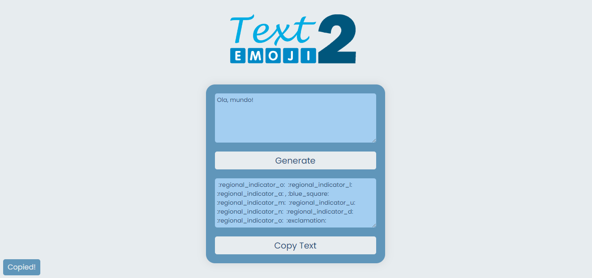

# Projeto Text2Emoji
>  Projeto que transforma o que o usuário digita em emoji para o Discord.

## Como usar
1. Digite no campo de cima a mensagem que deseja transformar;
2. Gere e copie a mensagem;

4. Cole em qualquer chat do Discord e ver o resultado!

## Caracteres

Aceitos | Não aceitos
:---: | :---:
A-Z | Acentos
0-9 | Letras estrangeiras
?! | .,
\+\-\= | @$%&()
\#\* | Todo o resto

